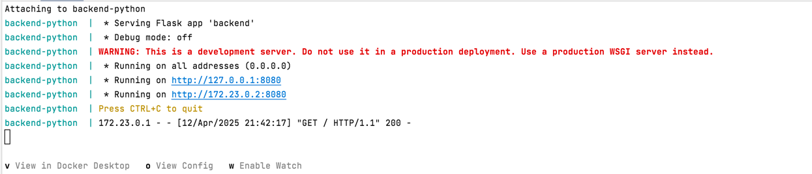

## Зачем нужна мультистейджинг сборка?

- для приложений с компиляцией **чтобы не тянуть лишние пакеты** и зависимости.
- чтобы **сделать докер образ гораздо легче** — тк мы не тянем туда весь pip, build-tools и тп
- Для бэкенда на Python можно использовать мультистейджинг для:

1) сборки зависимостей в первом docker образе
2) переноса только нужных бинарных файлов в рантайм-слой (на втором образе)

Как итог, происходит сборка в одном, запуск в другом образе


---

### Данная команда в композере каждый раз создает новый образ

```bash
docker-compose up --build --force-recreate
```

или можно игнорироавать закэшированные слои

```bash
docker-compose build --no-cache
```

Результат запуска



Собранное приложение в браузере


